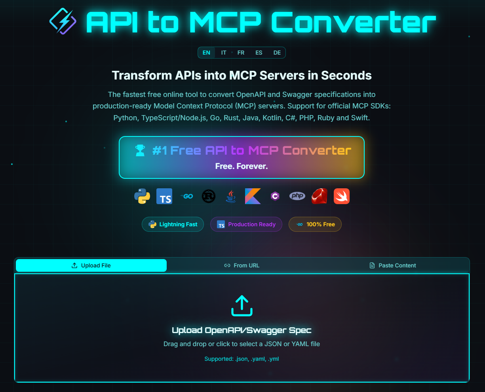

<div align="center">


🌐 **Working Live**: [https://convertmcp.com](https://convertmcp.com)


[](https://opensource.org/licenses/MIT)
[](https://reactjs.org/)
[](https://www.typescriptlang.org/)
[](https://vitejs.dev/)

</div>


> **Transform OpenAPI/Swagger specifications into production-ready Model Context Protocol (MCP) servers in seconds!**


A free, open-source online tool that converts API specifications into MCP servers with support for 10+ programming languages. 100% client-side processing ensures your API specs never leave your browser.


<div align="center">

[](https://www.paypal.com/donate/?hosted_button_id=9CSNUCM9FX53S)

**💙 Support this project! If you find it useful, consider buying me a coffee ☕**

</div>

## ✨ Features

### 🎯 Core Functionality
- **Instant Conversion**: Transform OpenAPI/Swagger specs to MCP servers in seconds
- **Multi-Language Support**: Generate code for Python, TypeScript, Go, Rust, Java, Kotlin, C#, PHP, Ruby, and Swift
- **Official SDKs**: Uses official Model Context Protocol SDKs for each language
- **Production-Ready Code**: Generated code follows best practices with proper error handling

### 🔒 Privacy & Security
- **100% Client-Side**: All processing happens locally in your browser
- **No Server Upload**: Your API specifications never leave your device
- **No Registration**: Free to use, no account required

### 🌍 Internationalization
- **5 Languages**: Full support for English, Italian, French, Spanish, and German
- **Auto-Detection**: Automatically detects browser language
- **Complete Translation**: All UI elements, documentation, and blog posts translated

### 🎨 User Experience
- **Multiple Input Methods**: 
  - Upload JSON/YAML files
  - Load from URL
  - Paste content directly
- **Endpoint Selection**: Choose which API endpoints to include
- **Real-time Preview**: See your selection before generating
- **Instant Download**: Get a ready-to-use ZIP bundle

## 🚀 Quick Start

### Prerequisites
- Node.js 18+ or Bun
- npm, yarn, or bun package manager

### Installation

```bash
# Clone the repository
git clone https://github.com/walterwootz/api-mcp-magic.git
cd api-mcp-magic

# Install dependencies
npm install
# or
bun install

# Start development server
npm run dev
# or
bun run dev
```

The application will be available at `http://localhost:5173`

### Build for Production

```bash
# Build the application
npm run build
# or
bun run build

# Preview the production build
npm run preview
```

## 🛠️ Tech Stack

- **Frontend Framework**: React 18 with TypeScript
- **Build Tool**: Vite 5 with SWC
- **UI Components**: Radix UI + shadcn/ui
- **Styling**: Tailwind CSS
- **Routing**: React Router v6
- **Internationalization**: i18next with browser language detection
- **Form Handling**: React Hook Form + Zod validation
- **Code Generation**: Custom generators for 10+ languages
- **File Processing**: JSZip for bundle creation

## 📁 Project Structure

```
api-mcp-magic/
├── public/
│   ├── icons/          # Language technology logos
│   └── robots.txt
├── src/
│   ├── components/     # React components
│   │   ├── ui/        # Reusable UI components (shadcn)
│   │   ├── AnimatedBackground.tsx
│   │   ├── EndpointSelector.tsx
│   │   ├── FileUpload.tsx
│   │   ├── NavLink.tsx
│   │   └── TechnologySelector.tsx
│   ├── hooks/         # Custom React hooks
│   ├── i18n/          # Internationalization
│   │   ├── config.ts
│   │   └── locales/   # Translation files (en, it, fr, es, de)
│   ├── lib/           # Utility libraries
│   │   ├── code-generators.ts    # MCP code generation
│   │   ├── openapi-parser.ts     # OpenAPI spec parsing
│   │   ├── utils.ts
│   │   └── zip-generator.ts      # ZIP bundle creation
│   ├── pages/         # Route pages
│   │   ├── blog/      # Blog articles
│   │   ├── Index.tsx
│   │   └── NotFound.tsx
│   ├── App.tsx
│   └── main.tsx
├── LICENSE            # MIT License
├── README.md         # This file
└── package.json
```

## 🌐 Supported Languages & SDKs

The converter generates production-ready code for:

| Language | SDK | Status |
|----------|-----|--------|
| Python | `@modelcontextprotocol/sdk` | ✅ Official |
| TypeScript/Node.js | `@modelcontextprotocol/sdk` | ✅ Official |
| Go | Community SDK | ✅ Supported |
| Rust | Community SDK | ✅ Supported |
| Java | Community SDK | ✅ Supported |
| Kotlin | Community SDK | ✅ Supported |
| C# | Community SDK | ✅ Supported |
| PHP | Community SDK | ✅ Supported |
| Ruby | Community SDK | ✅ Supported |
| Swift | Community SDK | ✅ Supported |

## 🤝 Contributing

Contributions are welcome! Please read [CONTRIBUTING.md](CONTRIBUTING.md) for details on our code of conduct and the process for submitting pull requests.

### Development Guidelines

1. **Fork the repository**
2. **Create a feature branch**: `git checkout -b feature/amazing-feature`
3. **Commit your changes**: `git commit -m 'Add amazing feature'`
4. **Push to the branch**: `git push origin feature/amazing-feature`
5. **Open a Pull Request**

## 📝 License

This project is licensed under the MIT License - see the [LICENSE](LICENSE) file for details.

## 🙏 Acknowledgments

- [Model Context Protocol](https://modelcontextprotocol.io/) by Anthropic
- [Radix UI](https://www.radix-ui.com/) for accessible components
- [shadcn/ui](https://ui.shadcn.com/) for beautiful UI components
- [Lucide Icons](https://lucide.dev/) for icons
- All contributors and users of this tool

## 💬 Support

- **Issues**: [GitHub Issues](https://github.com/walterwootz/api-mcp-magic/issues)

## 🌟 Star History

If you find this project useful, please consider giving it a star ⭐

**Deploy to any static hosting**

This is a static React application that can be deployed to:
- Vercel
- Netlify  
- GitHub Pages
- Cloudflare Pages
- Any static hosting service
